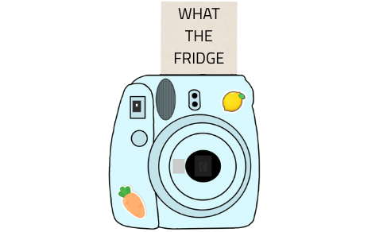
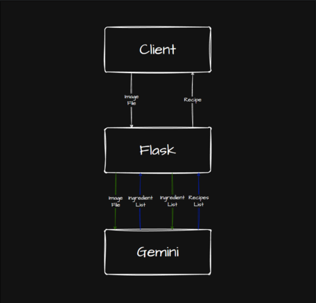
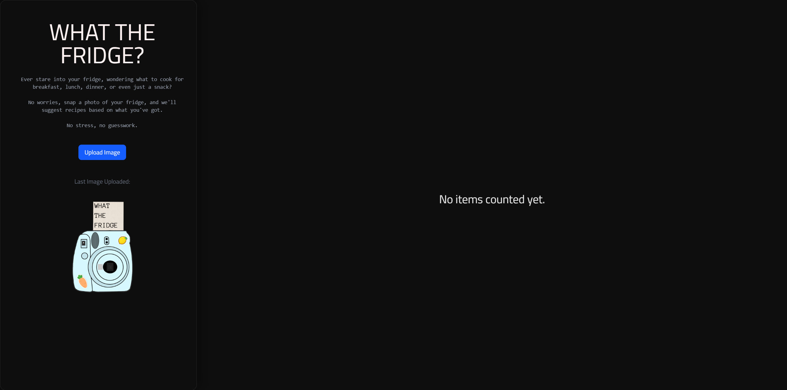

<p align="center">
  
</p>

# What The Fridge

## Description

Ever stared into your fridge not knowing what to friding cook? Say goodbye to that dilemma, because **What The Fridge** is here!

With What The Fridge, you can:

- Snap a photo of your fridge and we’ll scan your ingredients—no more pointless typing.
- Add or remove any items we mis-scanned or that you want to include.
- Get an estimate of the cost of your groceries and see how much you’ll save compared to takeout.
- Discover recipe ideas based on what you already have, with estimated costs and savings.
- Calculate the average nutritional value of your dish, so you know exactly what you’re eating.

Cooking just got a whole lot easier (and smarter). Welcome to **What The Fridge**—your ultimate friding assistant!


## Youtube Video 

Link: https://youtu.be/wHXeJlj0U_A

## Key Feature:
- **Upload Fridge Image**: Snap or upload a photo of your fridge, and we’ll automatically scan and identify the ingredients inside.
- **Edit Ingrident List**: Easily add, remove, or update items in your ingredient list, including quantity and unit cost.
- **Get Recipe Ideas**: Generate creative recipe ideas based on your available ingredients, with cost and nutritional estimates.

### Technologies Used

- **Backend**: Python + Flask , Google Gemini API
- **Frontend**: Javascript + ReactJS, Tailwind
- **Cloud deployment**: ... 

## Flowchart

<p align="center">
  
</p>

The diagram above illustrates the system architecture for image uploads and recipe generation using Flask and Google Gemini.

- The client uploads a fridge image to the Flask server.
- The server sends the image to Gemini for analysis and receives a list of detected ingredients.
- The client can then review, edit, or update the ingredient information.
- When the user requests a recipe, the server sends the updated ingredient list to Gemini, which generates recipe ideas and returns them to the client.

## Installation 

**1. Clone the repository:**

```Bash
git clone http...
cd what-the-fridge
```

**2. Install dependenices:**

1. Frontend dependencies

```Bash
npm install
```

2. Backend dependencies

```Bash
cd backend
pip install -r requirements.txt
```

**3. Create and activate a virtual environment**
1.Create virtual environment based on OS
- MacOS/Linux
```Bash
python3 -m venv .venv
```

- Windows
```Bash
py -3 -m venv .venv
```

2. Activate virtual environment based on OS

- MacOS/Linux
```bash
source .venv/bin/activate
```

- Windows (Command Prompt)
```cmd
.venv\Scripts\activate
```

- Windows (PowerShell)
```powershell
.venv\Scripts\Activate.ps1
```

3. Create a .env file in the backend directory
- You can generate one here: [Create a Google API Key](https://aistudio.google.com/api-keys)
Add your Google API key inside:
```env
GOOGLE_API_KEY=your_api_key_here
```
**3. Run the server**
1. Run the Flask server
```Bash
cd backend
flask --app server run
```

2. Frontend server
```Bash
cd what-the-fridge
npm run dev
```

## Screenshot



## API Documentation

| **Endpoint** | **Method** | **Description** | **Request Body** | **Response Examples** |
|---------------|-------------|------------------|------------------|------------------------|
| `/vision` | `POST` | Uploads an image file and analyzes its contents using the **Gemini Vision API**. Returns a JSON list of detected food items and their quantities. If no food items are detected, returns `{ "Invalid": 0 }`. | **form-data**:• `image_file` — *(required)* The image file to analyze (`.jpg`, `.jpeg`, `.png`). | **Success (200):** ```{ "Eggs": { "Quantity": 6 },"Red Cabbage": { "Quantity": 1 } }```<br><br>**No Food Detected (200):**```{ "Invalid": 0 }```<br><br>**Error (400):**```{ "error": "Invalid file type. Please upload an image." }``` |                                                                                                                                                                                                  
`/generate_recipe` | `POST`     | Generates multiple creative yet realistic recipes based on the user’s available ingredients and optional allergy information. Uses the **Gemini API** to produce detailed recipe data in strict JSON format. | **application/json**:<br>`json { "Eggs": { "Quantity": 6 }, "Red Cabbage": { "Quantity": 1 }, "Allergies": "nuts" }` | **Success (200):**<br>`json { "Savory Sausage and Cabbage Egg Scramble": { "Ingredients": [ { "name": "Packaged Meat (Sausage)", "amount": "0.5 unit" }, { "name": "Green Cabbage", "amount": "0.25 unit" } ], "NutritionalValues (Estimated)": { "Calories": 350, "Protein (g)": 20, "Fat (g)": 25, "Carbohydrates (g)": 10 }, "AverageCostOfDishOutside (Estimated)": 10.50, "MoneySavedIfMade": 8.10 } }`<br><br>**Invalid JSON (400):**<br>`json { "error": "Invalid JSON format. Expected a dictionary." }`<br><br>**No Valid Ingredients (400):**<br>`json { "error": "No valid ingredients provided." }`<br><br>**Server Error (500):**<br>`json { "error": "Internal server error or Gemini API failure." }` |

## Contributers

<a href="https://github.com/vannaFeng/Hack-Knight-Project/graphs/contributors">
  
</a>
